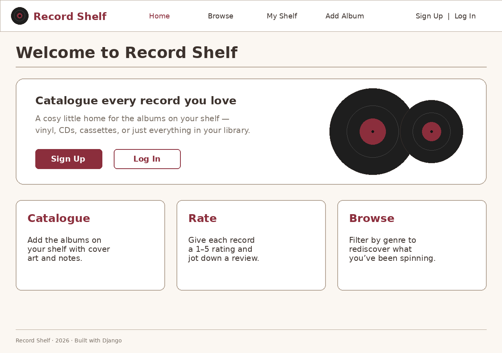
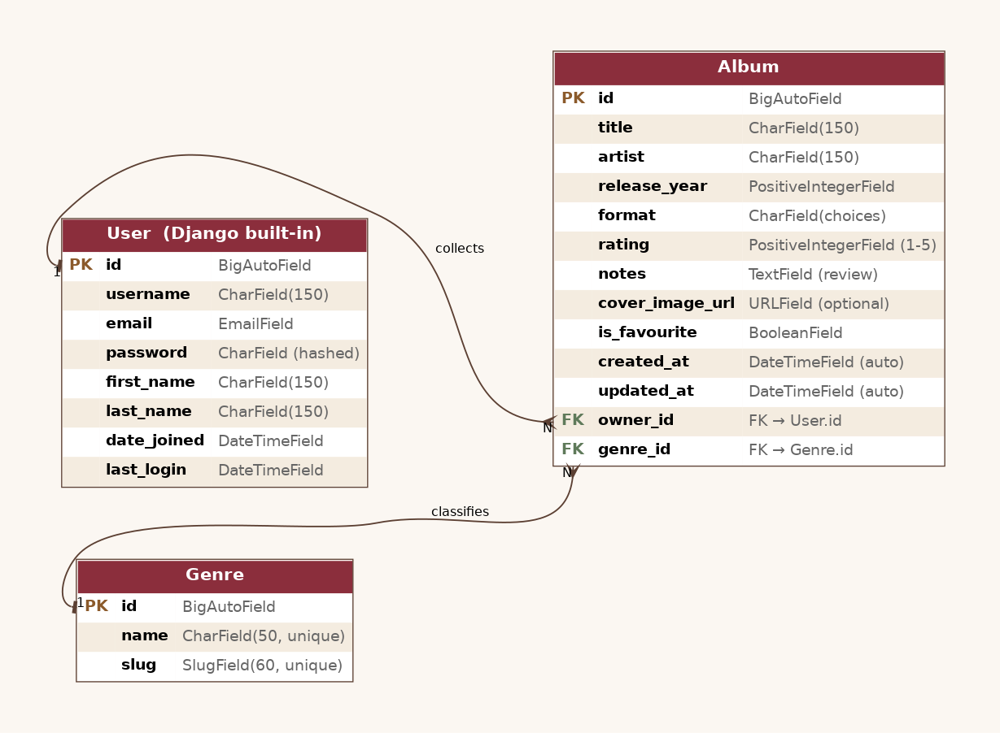

# Record Shelf

A full-stack Django CRUD app for cataloguing your personal music collection. Log
the albums you own, rate them out of five, tag them by genre, browse what's on
the shop floor, and curate your own private shelf. Built as the final project
for the General Assembly Software Engineering Immersive.

> **Live demo:** _coming soon — link will go here once deployed to Render._
>
> **Repository:** _https://github.com/&lt;your-github-username&gt;/record-shelf_

---

## Screenshot



---

## Description

Record Shelf is a Django-rendered web app (no SPA front-end) backed by
PostgreSQL. Visitors can browse every album that any user has added — filter by
genre, search by title or artist — and read individual album pages without an
account. Once a user signs up they get their own dashboard ("My shelf") where
they can add, edit and remove the records they personally own. Edit and delete
are guarded by ownership, so one user can never modify another user's albums.

Why a music app? It's a domain that maps cleanly to the CRUD assignment (one
user owns many albums), it's a fun thing to build a UI around (record sleeves,
ratings, year, format), and it gave me an excuse to design a vintage-record-shop
visual theme.

## Getting started

### Trello board (planning)

The full Trello board with MVP user stories, stretch goals, wireframes and ERD
notes lives at: **&lt;your Trello URL&gt;** _(replace with the public board link
once you've created it in Trello using `TRELLO_BOARD_CONTENT.md` from the
project root)._

### Run locally

```bash
# 1. Clone
git clone https://github.com/<you>/record-shelf.git
cd record-shelf

# 2. Create + activate a virtual environment
python -m venv .venv
source .venv/bin/activate            # macOS/Linux
# .venv\Scripts\activate             # Windows PowerShell

# 3. Install dependencies
pip install -r requirements.txt

# 4. Configure environment
cp .env.example .env
# edit .env with your local SECRET_KEY and DATABASE_URL

# 5. Set up the database (Postgres)
createdb recordshelf
python manage.py migrate

# 6. Create an admin user (optional, useful for adding more genres)
python manage.py createsuperuser

# 7. Run the dev server
python manage.py runserver
```

App will be available at <http://127.0.0.1:8000>.

Run the test suite:

```bash
python manage.py test
```

## Tech stack

- **Back end:** Python 3.12, Django 5.1
- **Database:** PostgreSQL (via `psycopg` 3 + `dj-database-url`)
- **Auth:** Django's built-in session-based auth (`django.contrib.auth`) with a
  custom `SignUpForm` that extends `UserCreationForm`
- **Front end:** Django templates, hand-written CSS (no framework), responsive
  CSS Grid + Flexbox, Google Fonts (Bebas Neue + Inter)
- **Static assets:** WhiteNoise
- **Production server:** Gunicorn
- **Deployment target:** Render (Procfile + runtime.txt included)
- **Version control:** Git + GitHub, feature-branch workflow

## Features

### MVP (delivered)

- Public landing page with calls-to-action
- Browse every album on the shop with genre filter + search by title/artist
- Read-only album detail page (anyone can view)
- Sign-up, log-in and log-out flows
- Authenticated users can **C**reate albums
- Authenticated users can **R**ead the full list and detail pages
- Album **U**pdate is restricted to the owner (HTTP 403 for non-owners)
- Album **D**elete is restricted to the owner (HTTP 403 for non-owners)
- "My shelf" dashboard listing only the current user's albums
- Genres seeded automatically via a data migration
- Responsive layout (mobile, tablet, desktop)
- Vintage record-shop visual theme — cream paper, burgundy, gold accents

### Stretch goals (post-MVP roadmap)

- Mark albums as favourite + a dedicated favourites view
- Per-user public profile page ("alice's shelf")
- Drag-and-drop cover image uploads (currently URL-only)
- Per-album comments from other users
- Tag system on top of genres (e.g. "summer", "road trip")
- CSV import/export of a user's shelf
- Spotify/Discogs API lookup to auto-fill metadata
- Pagination on the browse page once collections grow

## Data model (ERD)



Three entities, all standard Django:

- **`auth.User`** — Django's built-in user model. Owns many `Album`s.
- **`Album`** — title, artist, release year (validated 1900–2100), format
  (vinyl/CD/cassette/digital), rating 1–5, optional notes, optional
  cover image URL, `is_favourite` boolean, `created_at`/`updated_at`.
  - `owner` → `User` (`on_delete=CASCADE`, `related_name="albums"`)
  - `genre` → `Genre` (`on_delete=PROTECT`, so a genre can't be deleted while
    albums still reference it)
- **`Genre`** — name (unique) + auto-slug, used for the public filter dropdown.

The `Album.stars` property renders the rating as ★ characters for the templates.

## Routes

| Method | Path                           | View                | Auth      | Notes                                            |
|-------:|--------------------------------|---------------------|-----------|--------------------------------------------------|
|    GET | `/`                            | `home`              | public    | Landing page                                     |
|    GET | `/albums/`                     | `album_list`        | public    | Browse + filter + search                         |
|    GET | `/albums/<int:pk>/`            | `album_detail`      | public    | Single album page                                |
|    GET | `/albums/mine/`                | `my_shelf`          | required  | Current user's albums only                       |
| GET/POST | `/albums/new/`               | `album_create`      | required  | Create new album                                 |
| GET/POST | `/albums/<int:pk>/edit/`     | `album_update`      | owner     | Returns 403 for non-owners                       |
| GET/POST | `/albums/<int:pk>/delete/`   | `album_delete`      | owner     | Confirm-then-delete; 403 for non-owners          |
|    GET | `/accounts/signup/`            | `accounts.signup`   | public    | Custom signup form                               |
| GET/POST | `/login/`                    | built-in            | public    | Django's `LoginView`, custom template            |
|   POST | `/logout/`                     | built-in            | required  | Django's `LogoutView` (POST-only)                |
|    GET | `/admin/`                      | Django admin        | superuser | Used for seeding/managing Genres                 |

## Authorization model

- **Anonymous users** can read the landing page, the album list and album detail
  pages. Trying to create/edit/delete bounces to the login page.
- **Authenticated users** can create new albums and view "My shelf".
- **Owners only** can edit or delete a given album. The view checks
  `if album.owner != request.user: return HttpResponseForbidden(...)` and the
  edit/delete UI is only rendered for the owner. Non-owner POSTs receive a 403,
  not a redirect, so an attacker can't bypass the UI.

## Testing

`main_app/tests.py` covers:

- `Album.__str__` and the `stars` property
- The list page is publicly visible
- `/albums/new/` redirects anonymous users to login
- A non-owner GETting `/albums/<pk>/edit/` receives 403
- A non-owner POSTing `/albums/<pk>/delete/` receives 403 _and_ the album is
  not deleted
- The owner can successfully POST to delete and is redirected to "My shelf"

```bash
python manage.py test
```

## Deployment

Production-ready out of the box for Render (or any Heroku-style PaaS):

1. Push the repo to GitHub.
2. On Render, create a **PostgreSQL** instance — copy the `DATABASE_URL`.
3. Create a **Web Service** pointing at your repo with:
   - Build command: `pip install -r requirements.txt && python manage.py collectstatic --no-input`
   - Start command: _provided by `Procfile`_
   - Environment variables: `SECRET_KEY`, `DEBUG=False`, `ALLOWED_HOSTS=<your-render-host>`, `DATABASE_URL`
4. Render runs the `release` step (migrations) automatically before each deploy.

The `Procfile` covers `release` (migrate) and `web` (gunicorn). WhiteNoise
serves the collected static files.

## Project structure

```
record-shelf/
├── accounts/                  # signup form + view (login/logout via built-ins)
├── main_app/                  # Album + Genre models, views, forms, templates
│   ├── migrations/
│   │   ├── 0001_initial.py
│   │   └── 0002_seed_genres.py
│   ├── admin.py
│   ├── forms.py
│   ├── models.py
│   ├── tests.py
│   ├── urls.py
│   └── views.py
├── record_shelf/              # project settings + root URL config
├── static/css/styles.css      # vintage record-shop theme
├── templates/
│   ├── base.html
│   ├── home.html
│   ├── registration/{login,signup}.html
│   └── main_app/{album_list,album_detail,album_form,album_confirm_delete,my_shelf}.html
├── docs/                      # ERD + wireframes (committed for the README)
├── .env.example
├── .gitignore
├── manage.py
├── Procfile
├── requirements.txt
└── runtime.txt
```

## What I'd do next

The stretch-goal list above is the prioritised roadmap. The single highest-value
addition would be image uploads (so users don't need to find a public URL for
cover art), followed by a Discogs API integration for one-click metadata.

## Attributions

- Fonts: [Bebas Neue](https://fonts.google.com/specimen/Bebas+Neue) and
  [Inter](https://fonts.google.com/specimen/Inter), via Google Fonts.
- Built on top of the [Django](https://www.djangoproject.com/) framework.
- ERD rendered with [Graphviz](https://graphviz.org/).
- All code, copy and visual design by Tom Jones.
